# Artificial Intelligence 2018/2019
## Second Homework: Causal Inference

My model represents weightlifting.  

The variables are eleven in total. In the program, I renamed the state name for better readibility. It follows a description of each variable in order of appearence from left to right.

- goal. The final goal of the atleat. It can be bulking, gain muscle, or cut, loose body fat. States are bulk and cut
- weight. If true, the atleat gains weight from last month, if false otherwise. The states are called increased and not_increased
- diet. Represent what the athleat eats. It's outcome is true, athleat eats around 200~400 kcal more that his baseline, false otherwise. These states are called surplus and defict
- sleep. How much the athleat sleeps. We assume that sleep time begin around 23:00 ~ 00:00. The outcome is 1 if the athleat sleeps more that 7.5 hourse, 0 otherwise.
- rest. The hours between two workouts. enough if more than 36 hours, low otherwise.
- sex. male and female.
- body fat. increased and not_increased from last month.
- genetic. good or averege. The genetic of the atleat.
- hormones. low is hormone production is under average, high if more. Hormones such as gh and testosterone are essetianl to gains.
- gains. Measured in grams of muscle per month. increase if more than 300g, same otherwise.
- 1RM_increase. In % how much we increase the one range of motion from last month on the base exercises: deadlift, squat and bench press. increase if 5% more than last month, not increase otherwise.

It follows an explanation of the arcs in the graph. body fat depends by the weight, the diet, booth depend of the age, and the gains. The more you gain the more you weight.

gains is the most important node. It depends by weight, diet, sleep, rest and hormone production. The late, directly depend on sex, sleep and diet. 

1RM increase depends on the gains.

#### State which is the objective of the network: for instance, highlight a couple of situations in which decision making could be difficult and in which the graph could provide valuable indications.

Probably a mix of situations for `gains`. For instance, if the athleat sleeps more than 7.5 hours, eat enought but does not rest more than 36 hours. An other could be where the diet prevents a correct hormones production but the athleat trains, sleep and rest well.

#### Explaining how you decide the arcs orientation, in case they are not self- explaining.

They are all streigthforward.

#### Which arrows can be reversed without being detectable by a statistical test? Explain why.

The following set of edges can be reversed without being detectable by a statistical test.
$(e(goal, weight), e(goal, diet), e(gains, 1RM increase))$ 

#### Identify at least 4 couple of nodes (the node of each couple should be not directly linked to each other) and analyze their d-separation properties possibly conditioning on others.

The nodes of the net are denominated by the first two consonant in the name for simplicity.

1. (`goal`, `body_fat`)
These are the paths: $\{GL,WT,BF\}, \{GL,DT,BF\}, \{GL,DT,GN,BF\}  \{GL,DT,HR,GN, BF\}$

They are all chains, thus we can block them by conditioning on $\{WT,DT\}$

2. (`goal`, `gains`)
These are the paths: $\{GL,DT,GN\}, \{GL, WT, BF, GN\}, \{GL,DT, BF, GN\}  \{GL, DT ,HR, GN\}, \{GL, WT, BF, DT, GN \}, \{GL, WT, BF, DT, HR, GN \}$

$BF$ is a collider for $WT, DT, GN$ so it already blocks some paths. We can condition on $DT$ to block al paths.

3. (`goal`, `hormones`)
These are the paths : $\{GL, WT, BF, GN, HR \}, \{GL, WT, BF, DT, HR \}, \{GL, WT, BF, DT, GN, HR \}, \{GL, DT, BT, GN, HR \}, \{GL, DT, GN, HR \} \{GL, DT, HR \}$.

As before, we can block on $DT$ to block all paths between $GL$ and $HR$.

4. (`diet`, `sleep`)
These are the paths: $\{DT, GN, SL \}, \{DT, BF, GN, SL \}, \{DT, HR, GN, SL \}, \{DT, GL , WT, BF, GN, SL \},  \{DT, GL , WT, BF, GN, HR, SL \}$

All the paths are already blocked by $GN$ that is a collider.

#### Discuss how d-connected variables are in fact dependent in the real problem, while d-separated variables are instead independent in the real problem.

- `goal` and `weight` are dependet since the goal that we choose determinate the weight we want to have
- `goal` and `diet` are dependent since the goal we picked also must be followed by a correct diet. If we want to loose weight, we must eat less
- `diet` and `sleep`. They independent, since what a person eat does not have repercussion on the sleep time an quality. 
- `hormones ` and `body fat` are likely dependent since if an atleat produces more hormones it can gains more muscle and increase his body fat. Unfortunally, it is scientific prooved that is impossibile to gain muscle and loose fat at the same time. For the interested reader it follows a very simple explanation. To syntetize new muscle tissue the body needs to have a surplos of energy. Thus we must eat more than our base metabolism needs, this is called 'bulking'. Having more energy leads to gain more weight and some body fat. The amount of body fat is directly proportional at the amount of kcal in surplus. Hoewer, they are several factors that also can influence the amount of body fat in a person, such as a history of bad diet and poor training. 
- `gains` and `body fat` are depending. This can be seen very intuitivelly by following the explanation in the last paragraph. Again, if we gain muscle then we must had a surplus of kcal in the dies, so we have gain also some body fat
- `gains` and `1RM increase`. Surely, in we increase the amount of muscle we also will lift more.
- `rest` and `1RM increase`. Resting between workouts avoid over training and leave to our body the time to build new muscles to be able to adapt and lift more.
  
  Ab interesting consideration is that if we set `gains` to true and I know the current `diet` is in surplus then I can correctly guess the outcome of `sleep` since if a person eat enough and had gains then it must have slept for a correct amount of time.
  
## Conditional probability tables (CPTs)
For the data I have relied on your personal experience/common sense.

### goal
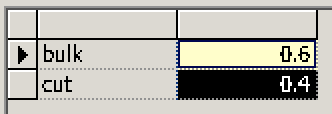

Usually people that do weightlifting want to build muscle. 

### weight
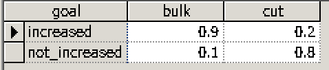

Of course, if we bulk we expect in almost all cases to increase our weight. Sometimes, due to some other factors, like stress or bad habits, this may influence our way to eat, train etx and thus we are not gain new weight. 

If the cut period is not properly planned, some people can eat a lot after a too strong diet and thus exponentially increase their weight instead of reduce it.

### diet
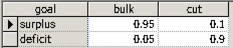

If we bulk we have no eat more, since this is very easy  we have a very low probably to still be in deficit. This reflect the case where we think we are eating enough but we are still in deficit. Cutting is harder since an atleath needs to correctly tracks is kcal so we have a 10% probability of still beeing in surplus.

### sleep
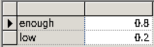

Some people does not sleep enough. Be aware that sleep does not only take in account the number of hours slept but also the time we go to bed. There is a big difference between an atleath that goes to bed at 23 and wakes up at 7 than one that goes to bed ad 01 and wakes up at 9.

### rest
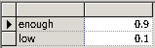

Even if is well know that our body need some rest time between workouts, some people still over train.

### sex
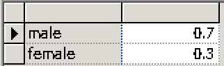

Most of the weightlifters are male.

### genetic
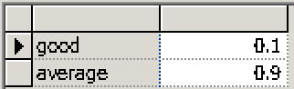

Only a small part of the population has a good genetic

### body fat
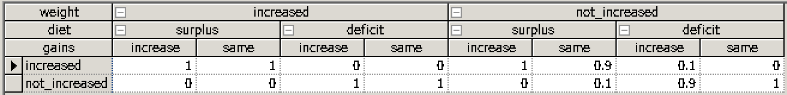

Body fat depends on weight, diet and gains. If we are in surplus then our body fat will increase no matters what.

### gains
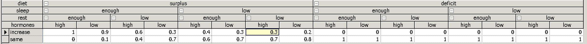
Gains are the core node in the graph. They depends on a lot of factor. Intuitivelly, in everything goes well, first column, we will gain muscle. If some of the variables such as rest, sleep and diet are not positive we will probably not gain a lot

### hormones
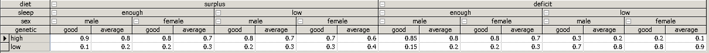

### 1RM
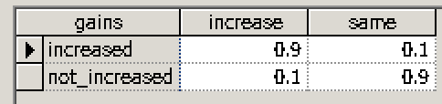
