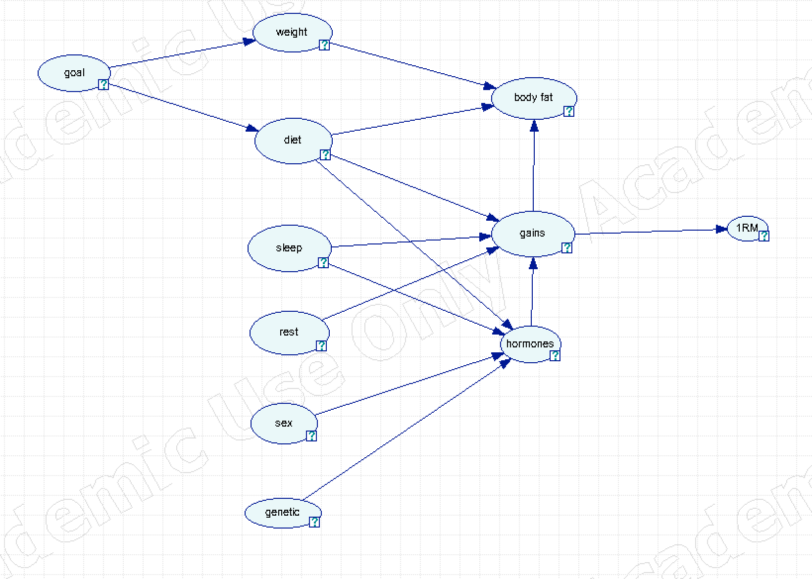

# Artificial Intelligence 2018/2019
## Second Homework: Causal Inference

My model represents weightlifting.  

The variables are eleven in total. In the program, I renamed the state name for better readibility. It follows a description of each variable in order of appearence from left to right.

- goal. The final goal of the atleat. It can be bulking, gain muscle, or cut, loose body fat. States are bulk and cut
- weight. If true, the atleat gains weight from last month, if false otherwise. The states are called increased and not_increased
- diet. Represent what the athleat eats. It's outcome is true, athleat eats around 200~400 kcal more that his baseline, false otherwise. These states are called surplus and defict
- sleep. How much the athleat sleeps. We assume that sleep time begin around 23:00 ~ 00:00. The outcome is 1 if the athleat sleeps more that 7.5 hourse, 0 otherwise.
- rest. The hours between two workouts. enough if more than 36 hours, low otherwise.
- sex. male and female.
- body fat. increased and not_increased from last month.
- genetic. good or averege. The genetic of the atleat.
- hormones. low is hormone production is under average, high if more. Hormones such as gh and testosterone are essetianl to gains.
- gains. Measured in grams of muscle per month. increase if more than 300g, same otherwise.
- 1RM_increase. In % how much we increase the one range of motion from last month on the base exercises: deadlift, squat and bench press. increase if 5% more than last month, not increase otherwise.

It follows an explanation of the arcs in the graph. body fat depends by the weight, the diet, booth depend of the age, and the gains. The more you gain the more you weight.

gains is the most important node. It depends by weight, diet, sleep, rest and hormone production. The late, directly depend on sex, sleep and diet. 

1RM increase depends on the gains.

#### State which is the objective of the network: for instance, highlight a couple of situations in which decision making could be difficult and in which the graph could provide valuable indications.

Probably a mix of situations for `gains`. For instance, if the athleat sleeps more than 7.5 hours, eat enought but does not rest more than 36 hours. An other could be where the diet prevents a correct hormones production but the athleat trains, sleep and rest well.

#### Explaining how you decide the arcs orientation, in case they are not self- explaining.

They are all streigthforward.

#### Which arrows can be reversed without being detectable by a statistical test? Explain why.

The following set of edges can be reversed without being detectable by a statistical test.
$(e(age, weight), e(age, diet), e(gains, 1RM increase))$ 

#### Identify at least 4 couple of nodes (the node of each couple should be not directly linked to each other) and analyze their d-separation properties possibly conditioning on others.

The nodes graphs are denominated using letters by following the alphabet from left to right from top to bottom. It should be easy to the reader to remap them.

1. (`genetic`, `body_fat`)
There are five paths: $\{A,B,G\}, \{A,C,G\}, \{A,C,H,G\}  \{A,B,H,G\},  \{A,C,I,H,G\}$

They are all chains, thus we can block them by conditioning on $\{B,C\}$

2. (`genetic`, `gains`)
There are five paths: $\{A,B,H\}, \{A, B, G, H\}, \{A,C, H\}  \{A,C,G,H\},  \{A,C,I,H\}$

In the second path, $G$ is a collider for $B, H$. We can condition on $B, C$. $B$ will prevent the paths $\{A,B,H\},  \{A, B, G, H\}$. $C$ will prevent the paths $\{A,C, H\} \{A,C,G,H\},  \{A,C,I,H\}$.

3. (`genetic`, `hormones production`)
There are five paths: $\{A,C,I\}, \{A, C, H, I\},  \{A,B ,G, H, I\},  \{A, B, H, I\}, \{ A,B,G,C,H,I\}$. We just need to condition on $C$ to block the chain $\{ A, C, I\}$ since $G$ is a collider for $B$ and $H$ while $H$ is a collider for $B$ and $I$ so they are already blocked.

4. (`diet`, `sleep`)
There are five paths: $\{C, H, D \}, \{ C,G,H,D\}, \{C, H, I, D\}$.
All those paths are already blocked by $H$ that is a collider

#### Discuss how d-connected variables are in fact dependent in the real problem, while d-separated variables are instead independent in the real problem.

- `genetic` and `weight` are dependnt since with a good genetic also influence weight. The reader must know at least one person that without training looks buffed.
- `genetic` and `diet` are dependent since genetic can influence the contrains of what a person can eat.
- `diet` and `sleep`. They independent, since what a person eat does not have repercussion on the sleep time an quality. 
- `hormones production` and `body fat` are likely dependent since if an atleat produces more hormones it can gains more muscle and increase his body fat. Unfortunally, it is scientific prooved that is impossibile to gain muscle and loose fat at the same time. For the interested reader it follows a very simple explanation. To syntetize new muscle tissue the body needs to have a surplos of energy. Thus we must eat more than our base metabolism needs, this is called 'bulking'. Having more energy leads to gain more weight and some body fat. The amount of body fat is directly proportional at the amount of kcal in surplus. Hoewer, they are several factors that also can influence the amount of body fat in a person, such as a history of bad diet and poor training. 
- `gains` and `body fat` are depending. This can be seen very intuitivelly by following the explanation in the last paragraph. Again, if we gain muscle then we must had a surplus of kcal in the dies, so we have gain also some body fat
- `gains` and `1RM increase`. Surely, in we increase the amount of muscle we also will lift more.
- `rest` and `1RM increase`. Resting between workouts avoid over training and leave to our body the time to build new muscles to be able to adapt and lift more.